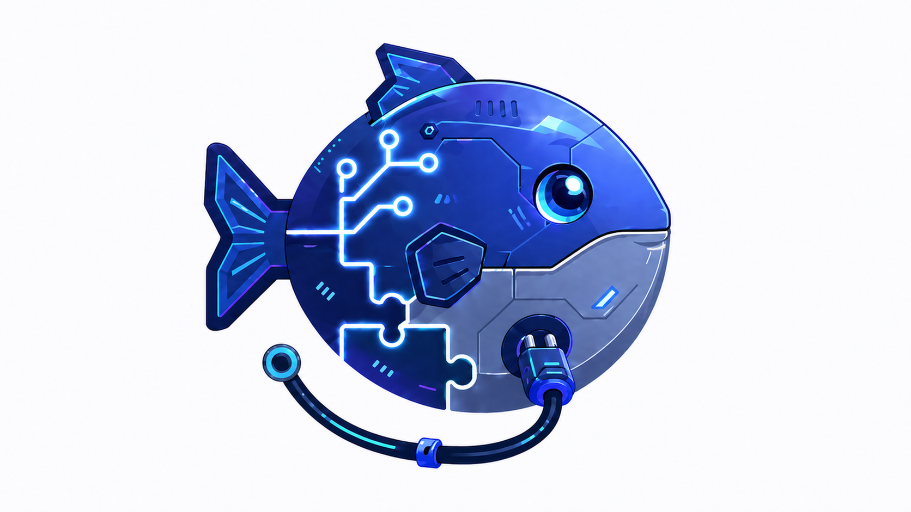
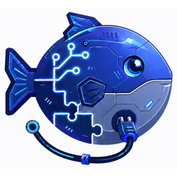

<p align="center">
  
</p>

# 胖鱼 PEtFiSh

**Self-adaptive skill installer for AI-assisted projects.**

从项目初始化到技能包自动安装，胖鱼引导你搭建AI-agent友好的工作区，并根据项目类型自适应安装所需技能。

From project initialization to adaptive skill installation — PEtFiSh guides you through setting up AI-agent-friendly workspaces and automatically installs the right skills for your project type.

Official brand assets:
- `assets/petfish-logo.png` — primary logo
- `assets/petfish-icon-256.png` — small icon/app/avatar version
- `assets/petfish-icon-64.png` — compact UI/icon version
- `assets/petfish-favicon-32.png` — favicon-sized PNG
- `assets/petfish-favicon.ico` — multi-size favicon for web/app packaging
- `assets/petfish-social-preview.png` — GitHub/social preview image

Branding work-in-progress files:
- `branding/logo_candidate_1.png`
- `branding/logo_candidate_2.png`
- `branding/logo_candidate_1_brand.png`
- `branding/logo_candidate_1_brand_B.png` — approved source variant

## Brand Asset Preview

<p align="center">
  
</p>

Recommended usage:
- GitHub repo social preview → `assets/petfish-social-preview.png`
- README / docs hero image → `assets/petfish-logo.png`
- App icon / avatar → `assets/petfish-icon-256.png`
- Browser favicon → `assets/petfish-favicon.ico`

## How It Works

```
┌─────────────────────────────────────────────────────┐
│  /initproject                                       │
│                                                     │
│  1. Scaffold project structure (init_project.py)    │
│  2. Auto-install recommended skill packs            │
│  3. Post-init wizard (AGENTS.md, README, Git, ...)  │
│  4. Ready to work — skills available immediately    │
└─────────────────────────────────────────────────────┘
```

## Quick Start

**One command to get started** — install the initializer globally, then use `/initproject` in any project:

```powershell
# Windows (PowerShell)
& ([scriptblock]::Create((irm https://raw.githubusercontent.com/kylecui/SKILL_builder/master/remote-install.ps1))) -Pack init
```

```bash
# macOS / Linux / WSL
curl -fsSL https://raw.githubusercontent.com/kylecui/SKILL_builder/master/remote-install.sh | bash -s -- --pack init
```

Then in OpenCode or Antigravity, type `/initproject` — PEtFiSh will:
1. Ask your project type (code/course/ops/writing/comprehensive/...)
2. Create the project scaffold
3. Install matching skill packs automatically
4. Walk you through a setup wizard (each step skippable)

## Skill Packs

| Alias | Pack | Contents | Default |
|-------|------|----------|---------|
| `init` | project-initializer-skill | Initializer + wizard + `/initproject` command | **Global** |
| `course` | opencode-course-skills-pack | 15 skills, 10 commands, 8 agents | Project |
| `testdocs` | opencode-skill-pack-testcases-usage-docs | Test case & doc generation | Project |
| `deploy` | repo-deploy-ops-skill-pack | CI/CD, deploy, ops automation | Project |
| `petfish` | petfish-style-skill | 说人话 — engineering writing style | Project |
| `ppt` | opencode-ppt-skills | Slide design & presentation | Project |

### Profile → Auto-Install Mapping

When you use `/initproject`, PEtFiSh installs packs based on your project type:

| Profile | Auto-Installed Packs |
|---------|---------------------|
| minimal | petfish |
| course | course, petfish |
| code | deploy, petfish, testdocs |
| ops | deploy, petfish |
| security | deploy, petfish, testdocs |
| writing | petfish, ppt |
| skills-package | petfish, testdocs |
| comprehensive | course, deploy, petfish, ppt, testdocs |

## Platform Support

| Platform | `--platform` | Project Skills | Global Skills | Global Commands |
|----------|-------------|---------------|--------------|----------------|
| OpenCode | `opencode` (default) | `.opencode/skills/` | `~/.config/opencode/skills/` | `~/.config/opencode/commands/` |
| Antigravity | `antigravity` | `.agents/skills/` | `~/.gemini/antigravity/skills/` | `~/.gemini/antigravity/workflows/` |
| Both | `all` | Both paths | Both paths | Both paths |

## Install Commands

### Remote (no clone needed)

```powershell
# PowerShell
& ([scriptblock]::Create((irm https://raw.githubusercontent.com/kylecui/SKILL_builder/master/remote-install.ps1))) -Pack <alias> [-Target .] [-Platform opencode] [-Force] [-Global]
```

```bash
# Bash
curl -fsSL https://raw.githubusercontent.com/kylecui/SKILL_builder/master/remote-install.sh | bash -s -- --pack <alias> [--target .] [--platform opencode] [--force] [--global]
```

### Local (cloned repo)

```powershell
.\install.ps1 -Pack <alias> [-Target path] [-Platform opencode|antigravity|all] [-Force] [-Global]
.\install.ps1 -List
```

```bash
./install.sh --pack <alias> [--target path] [--platform opencode|antigravity|all] [--force] [--global]
./install.sh --list
```

### Private repos

```bash
curl -fsSL -H "Authorization: token $GITHUB_TOKEN" \
  https://raw.githubusercontent.com/kylecui/SKILL_builder/master/remote-install.sh \
  | GITHUB_TOKEN=$GITHUB_TOKEN bash -s -- --pack course
```

```powershell
& ([scriptblock]::Create((irm https://raw.githubusercontent.com/kylecui/SKILL_builder/master/remote-install.ps1))) -Pack course -GitHubToken $env:GITHUB_TOKEN
```

## Antigravity Quick Start

```powershell
# Install initializer globally for Antigravity
& ([scriptblock]::Create((irm https://raw.githubusercontent.com/kylecui/SKILL_builder/master/remote-install.ps1))) -Pack init -Platform antigravity

# Install all packs into your project
& ([scriptblock]::Create((irm https://raw.githubusercontent.com/kylecui/SKILL_builder/master/remote-install.ps1))) -Pack all -Platform antigravity -Target .
```

After installation:

```
your-project/
├── .agents/
│   ├── skills/                ← Skill files
│   ├── rules/                 ← Agent rules
│   ├── workflows/             ← Workflows (commands)
│   └── installed-packs.json   ← Install registry
├── AGENTS.md                  ← Project instructions
└── GEMINI.md                  ← Antigravity-specific
```

## Global vs Project Install

- **Global** (`--global`): Skills + commands installed to user-level directory. Available across all projects. The `init` pack defaults to global.
- **Project** (default): Installed to target project's `.opencode/` or `.agents/` with AGENTS.md merge, opencode.json merge, and registry tracking.

## Prerequisites

- **uv** (recommended): Required for Python-based skills. Install from https://docs.astral.sh/uv/getting-started/installation/
- The installer warns if uv is not found.

## Adding a New Pack

1. Create a directory under `packs/` with your pack name
2. Add `.opencode/` containing `skills/`, `commands/`, and/or `agents/`
3. Optionally add `pack-manifest.json` for metadata
4. Pack's `AGENTS.md` → marker-based merge into target project
5. Pack's `opencode.example.json` → deep-merged into target's `opencode.json`
6. Add an alias in the install scripts for a short name

## Structure

```
SKILL_builder/
├── packs/
│   ├── project-initializer-skill/    ← init (global-default)
│   ├── opencode-course-skills-pack/  ← course
│   ├── opencode-skill-pack-testcases-usage-docs/ ← testdocs
│   ├── repo-deploy-ops-skill-pack/   ← deploy
│   ├── petfish-style-skill/          ← petfish
│   └── opencode-ppt-skills/          ← ppt
├── install.ps1          ← Local PowerShell installer
├── install.sh           ← Local Bash installer
├── remote-install.ps1   ← Remote PowerShell installer
├── remote-install.sh    ← Remote Bash installer
└── README.md
```

---

> **胖鱼 PEtFiSh** — 让每个项目从第一天就有正确的AI技能加持。
>
> Every project gets the right AI skills from day one.
